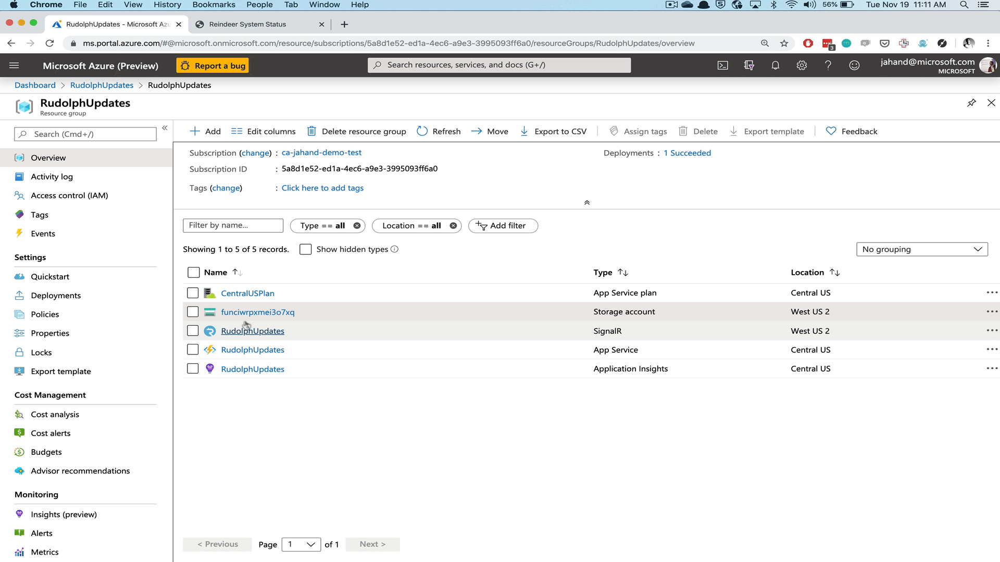

# Reindeer Guidance & Delivery System - Status Updates

Santa and his reindeer get almost all the credit when it comes to delivering gifts on Christmas Eve.

But if it weren't for the elves on the Engineering & IT teams building, operating, and supporting the systems that help make all that "magic" happen, there would be a lot of dissapointed children around the world on Christmas day.

When the systems that help Santa and his reindeer make their deliveries experience problems, elves are immediately dispatched to diagnose and restore service. During those tense disruptions, it's important everyone stay "in the know" about what is known, who is doing something about it, and when we should expect further updates.


## Challenge

Build a method to communicate the current status and running log of *service disruptions* to a global audience.

## Solution

Santa's globally distributed team of helpers can use their mobile phones to immediately update the rest of the team the status of service disruptions via a web page that refreshes without user interaction. Additionally, it will provide a running log of each update received over time for greater context and awareness.


#### Tech Used

The brains behind this solution is an Azure Function (running Node.js) that is triggered via outgoing webhook (from Microsoft Teams). The function modifies an index.html file stored in a "web server" served from a serverless SMB file share in Azure Storage.

Users can `open`, `update`, and `close` "status updates" by invoking them from within a chat channel. 

The text that follows the command will be stored and displayed on the site below the colored (Red or Green) header.

In addition to the website files, an Azure Table will be used for storing the history of each status update. 
>**NOTE:** The table is not provisioned with the deployment script. It needs to be manually created in Step 2 below. 

SignalR manages refreshing the client so that changes made to the HTML are immediately visible without any end user interaction.

Application Insights is used to provide observability on the operation, behavior, and usage of the solution and is "best practice" for building highly available and reliable system... which we expect from any Status Page solution.

|*Quick Links*|Docs|Learn|
|---|---|---|
|Azure Function|[Link](https://cda.ms/16Z)|[Link](https://cda.ms/170)
|Azure Storage|[Link](https://cda.ms/174)|[Link](https://cda.ms/175)
|SignalR Services|[Link](https://cda.ms/177)|[Link](https://cda.ms/179)
|Application Insights|[Link](https://cda.ms/17b)| [Link](https://cda.ms/17d)

### Prerequisites

You will need an account with the following services: 

- [Microsoft Azure](https://cda.ms/16X)
- [Microsoft Teams](https://cda.ms/17f)

---

### Deployment Instructions:

The blue button below will deploy all resources needed for this solution in to the Resource Group and Azure region of your choice. The name you choose also determines the URL used to view the Status Page as well as the incoming URL used to trigger updates.

#### Steps To Deploy:

**1.** Create the Azure Function app, Storage account, and SignalR Service with this button: [](https://azuredeploy.net/)

>This will begin deploying everything needed for the solution and will provide a link to the public facing URL of the Status Page as well as a link to your new resource group where you will continue with step 2.

---

**2.** In the Azure portal, open the Storage account and add a table named `statuses`. You do not need to set any properties or add records.



---

**3.** Navigate to the function app, and open the `teams-webhook` function. Click "Get Function URL" and copy the URL.

---

**4.** Last, open Teams and navigate to the "Apps" page of the team in which you want to create the bot. Click "Create outgoing webhook".

- Use `StatusPage` as the bot name (this is hardcoded, for now). 
- Paste in the function URL, and enter a description and press the create button.

> You will be prompted with a secret code for validating webhook calls from Teams. We currently do not use this. Close the dialog box.

    


**5.** Open Microsoft Teams and update the status page by typing `@StatusPage` to summon the bot followed by `open We are experiencing a problem. Standby for more information`

Available commands are: 

```bot
        @StatusPage open [message]
        @StatusPage update [message]
        @StatusPage close [message]
        @StatusPage help`
```


---

This solution is based on the on-stage demonstrations built for Microsoft Ignite The Tour. 

To learn more about the full demonstration, view the repo for "[OPS20 - Responding To Incidents]()". Huge Thanks to [Anthony Chu]() in bringing this to life.


#### Resources

**Microsoft Azure:** [https://azure.microsoft.com/](https://cda.ms/16X)

**Azure Functions:**
- Product: [https://azure.microsoft.com/services/functions/](https://cda.ms/16Y)
- Docs: [https://docs.microsoft.com/azure/azure-functions/](https://cda.ms/16Z)
- Learn: [https://docs.microsoft.com/learn/modules/create-serverless-logic-with-azure-functions/](https://cda.ms/170)
- How To Get Started (Video): [https://azure.microsoft.com/resources/videos/get-started-with-azure-functions/](https://cda.ms/171)
- Supported Languages: [https://docs.microsoft.com/azure/azure-functions/supported-languages](https://cda.ms/172)

**Azure Storage:**
- Product: [https://azure.microsoft.com/services/storage/](https://cda.ms/173)
- Docs: [https://docs.microsoft.com/azure/storage/](https://cda.ms/174)
- Learn: [https://docs.microsoft.com/en-us/learn/modules/create-azure-storage-account/](https://cda.ms/175)

**SignalR:**
- Product: [https://azure.microsoft.com/services/signalr-service/](https://cda.ms/176)
- Docs: [https://docs.microsoft.com/azure/azure-signalr/signalr-overview](https://cda.ms/177)
- w/ Azure Functions: [https://docs.microsoft.com/azure/azure-signalr/signalr-concept-azure-functions](https://cda.ms/178)
- Learn: [https://docs.microsoft.com/learn/modules/automatic-update-of-a-webapp-using-azure-functions-and-signalr/](https://cda.ms/179)

**Application Insights:**
- Product: [https://azure.microsoft.com/services/monitor/](https://cda.ms/17b)
- Docs: [https://docs.microsoft.com/azure/azure-monitor/app/app-insights-overview](https://cda.ms/17b)
- Learn: [https://docs.microsoft.com/learn/modules/instrument-web-app-code-with-application-insights/](https://cda.ms/17d)

**Microsoft Teams:**
- Product: [https://products.office.com/microsoft-teams/group-chat-software](https://cda.ms/17f)
- Docs: [https://docs.microsoft.com/MicrosoftTeams/Microsoft-Teams](https://cda.ms/17g)
- Learn: [https://docs.microsoft.com/learn/modules/m365-teams-collab-apps-bots-connectors/](https://cda.ms/17h)

---